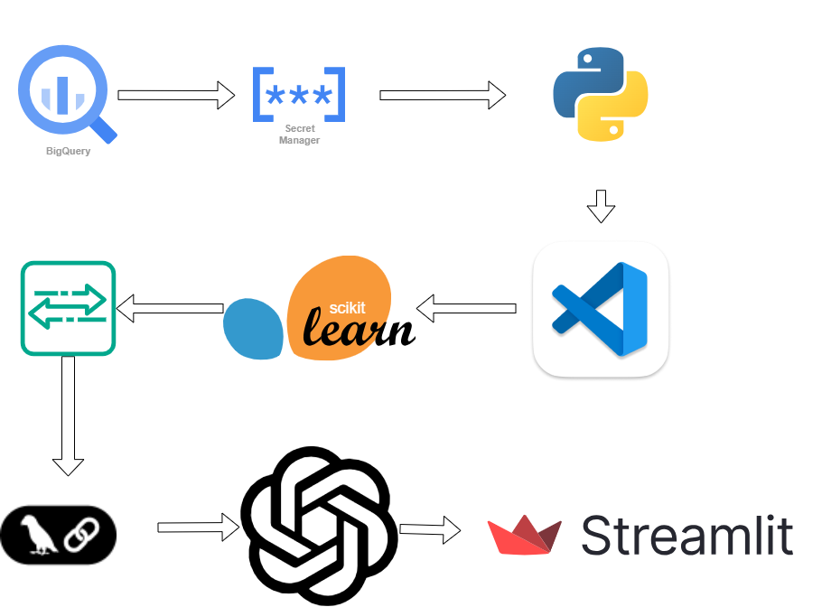
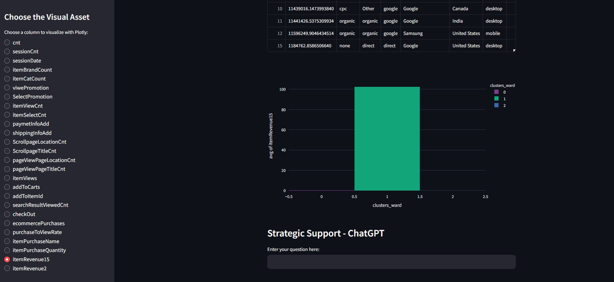
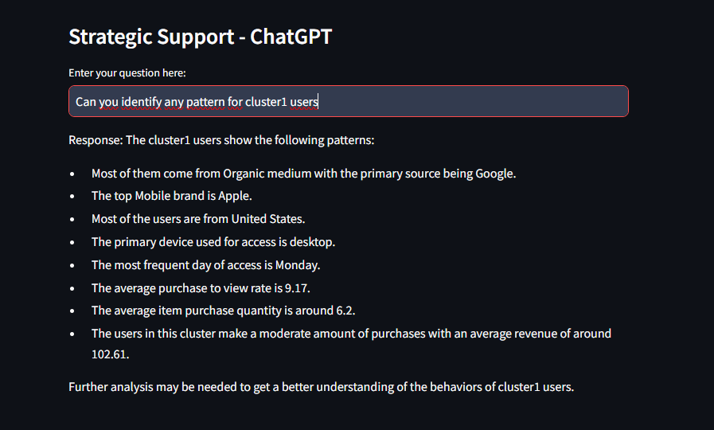

# User Clustering Project with ChatGPT Support



## Overview
This project groups users into clusters using machine learning models such as KMeans, DBSCAN, and Hierarchical Clustering. The results are shown in a web application built with Streamlit. A ChatGPT chatbot is also included to answer user questions about the data and clustering results.

## Workflow
### 1. **BigQuery**
   - **Data Access**: Large datasets from Google Cloud Platform’s BigQuery are queried and processed.

### 2. **GCP Secret Manager**
   - **Secure Data Management**: API keys and sensitive information are stored safely in GCP Secret Manager.

### 3. **Python and Scikit-learn**
   - **Clustering**: KMeans, DBSCAN, and Hierarchical Clustering methods are used to group users based on their behavior. XGBoost is used to find important features.

### 4. **Chatbot Integration**
   - **DataFrame Agent**: A chatbot is integrated to let users ask questions about the dataset. This helps improve the user experience by making the data more interactive.

### 5. **Streamlit Web Application**
   - **Visualization and Interaction**: The clustering results are shown using Plotly charts in a Streamlit app. Users can choose different metrics to see the data visualized. They can also ask the chatbot questions and get answers about the clusters.

## Clustering Methods

### KMeans Clustering
The KMeans algorithm was used to group users into clusters. The model’s performance was evaluated using inertia and silhouette scores.

### Hierarchical Clustering
Hierarchical Clustering was used to build a hierarchy of user clusters. The dendrogram visualization helped identify the optimal number of clusters. Below is a Plotly chart showing how different features change based on the **Hierarchical Clustering** results, as you can streamlit app page



## Chatbot Interaction
The Streamlit app includes a chatbot that answers questions about the clusters and features. 


Below is an example of interacting with the chatbot:



## Streamlit App Features
- **Cluster Selection**: Users can select different metrics (such as item revenue or session count) from the menu on the left and view the related graphs on the right.
- **Chatbot Support**: Users can ask the chatbot questions about the dataset and clustering results to get instant answers.

## How to Run the Project
1. Clone the repository:
   ```bash
   git clone https://github.com/belliogluyasemin/cluster-ChatGPT4.git
   cd cluster-ChatGPT4
   streamlit run app2.py

